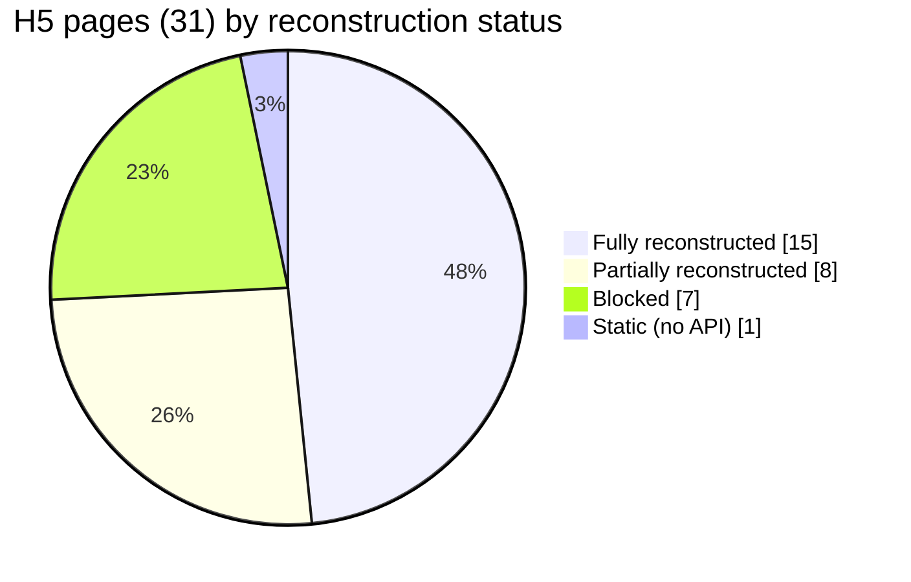

# ZaffaLive H5 — Feature Reconstruction Coverage

Status of the **Feature layer** (`rebuild/backend/src/upstream/zaffa/features/`) that reconstructs each
H5 page as a ViewModel over the typed Domain API. Read-only phase. Every ViewModel field derives only
from a **verified read endpoint** — no guessed data, no writes.

## Summary

| Metric | Value |
|---|--:|
| H5 pages given | 31 |
| **Fully reconstructed** | **15** |
| **Partially reconstructed** (needs list-element data) | **8** |
| **Blocked** (role-gated / disabled / unrouted) | **7** |
| Static (no API — client-only) | 1 |
| Feature modules | 18 |
| ViewModel-returning methods | 35 |
| Feature tests | 21 (part of 218 upstream tests, all green) |

## Fully reconstructed (15)

Every read surface the page shows is typed and available.

| H5 page | Feature.method | Notes |
|---|---|---|
| pay | `wallet.getOverview` | balance, jewel/star, jewel→coins, likes products |
| noble | `noble.getStatus` | level, tiers, integral (degrades gracefully) |
| wealth_grade | `wealthGrade.getGrade` | level/exp + full threshold ladder |
| my_level | `level.getSummary` | 4 ladders with derived progress bars |
| cp | `cp.getHouse` / `getGifts` / `getApplications` | sweet level, privileges, in/out applications |
| cpReward | `cp.getLastWeekRank` | weekly CP leaderboard + prize ladder |
| magicBox | `magicBox.getBoard` | energy, tasks, gift pool w/ normalized chances |
| luckyGift | `rebackGift.getHistory` | history rows w/ decoded `extra` reward |
| task | `task.getTasks` | new-user + daily task cards |
| giftWall | `room.getGiftWall` | sender→receiver→gift entries |
| roomRule | `room.getLevelPrizes` | room-level prize ladder |
| announcement | `notice.getBoard` | room notices |
| report | `report.getReasons` | report reason options (read side) |
| medalRank | `rank.getMedalRank` | medal ranking summary |
| totalRank | `rank.getRoomRankBoard` | room weekly/monthly top lists + prizes |

_(Plus the profile identity surface — `profile.getProfileCard` / `getFriendsSummary` — used by
`roomGroupRule` and others.)_

## Partially reconstructed (8) — container typed, list element = `unknown`

The page's primary data is reconstructed; a nested **list came back empty in every capture**, so its
element type is deliberately left `unknown` (flagged in the ViewModel with `hasData`/counts).

| H5 page | Feature | What's typed | Needs data for |
|---|---|---|---|
| luckyBox | `luckyBox.getTiers` | tier cost/discount | `gift_list`, billboard entries |
| luckyDraw | `luckyDraw.getPreview` | pool, prizes, mvp, recent draws | `prizeLogs.list` |
| luckyBag | `luckyBag.getConfigs` | tier configs | room bags, my bags |
| roomParty | `room.getActivityBoard` | owner, cover, online, showTypes | `activities` list |
| pkReward | `pk.getInfo` | PK tallies | `records` list |
| friendCenter | `friendCenter.getInvites/getCenter` | structure + counts | invite/center list items |
| pkRank | `rank.getGameRoomRank/getRocketRank` | owner card + prizes | ranking `list` |
| roomGroupRule | `profile.getProfileCard` | user identity | rule copy is static H5 (no endpoint) |

## Blocked (7) — cannot reconstruct read data now

| H5 page | Reason |
|---|---|
| anchor | Agency back-office (guild/anchor/withdrawal). Role-gated; needs a guild-owner account. |
| coinsMerchant | Coins-merchant back-office. Role-gated; needs a merchant account. |
| announcementFamily | `Action/Family.getIMList` — agency/family scope; deferred with the agency pass. |
| svip | `Action/SVip.getInfo` returns **"Feature disabled."** on live for this account. |
| pkRule | `Action/BDCenter.getGuildList` (agency) errors; the rest of the page is static copy. |
| roomScoreRank | `room.getRoomPopularRank` → **"unfound action in table"** (unrouted on live). |
| vipScoreRank | `room.getVipUserRank` → **"unfound action in table"** (unrouted on live). |

## Static (1)

| H5 page | Reason |
|---|---|
| rank | Pure client-side (intimacy-tier arrays baked into the page JS). No API to reconstruct. |

## Missing data required (to promote partials → full)

Re-capture these with the right state and the element types tighten with **zero code change to the
Feature layer** (only the model's `z.unknown()` gets replaced):

- **Populated room / party:** `Action/RoomAct.getActList.list` (an active party), `luckyBox.gift_list`,
  `Action/luckyBags.fetchRoomBags`.
- **User history/state:** `Action/LuckyDraw.prizeLogs.list`, `Action/luckyBags.fetchMeGotBags`,
  `Action/RadioRoomPk.pkRecordList` (past PKs), `luckyBox.getBillBoard`.
- **Best-friend relationships:** `Action/bestFriend.getInviteList` / `getInvitationList` / `center`.
- **Active rankings:** `Action/GroupPkRoom.getGameRoomRank.list`, `Action/RocketGift.rankList.list`,
  `medalRank.list`.

## To unblock the blocked pages

- **Privileged accounts:** a guild-owner session (anchor/family) and a coins-merchant session unlock
  the back-office reads — best done as a dedicated **agency-upstream pass**.
- **SVIP-enabled account** for the svip page.
- **Server-side:** the unrouted rank actions (`getRoomPopularRank`/`getVipUserRank`) are gone on the
  current server; those two pages can't be reconstructed against live until/if they return.

## Guarantees

- No write operations implemented anywhere in the read phase.
- Backward compatible: infrastructure + domain layers unchanged in behavior; only additive exports.
- `tsc` clean; **218 upstream tests pass** with no network (fake transport).
