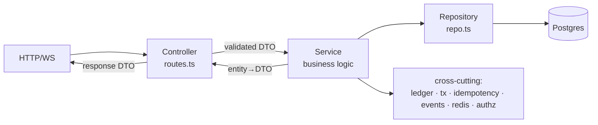
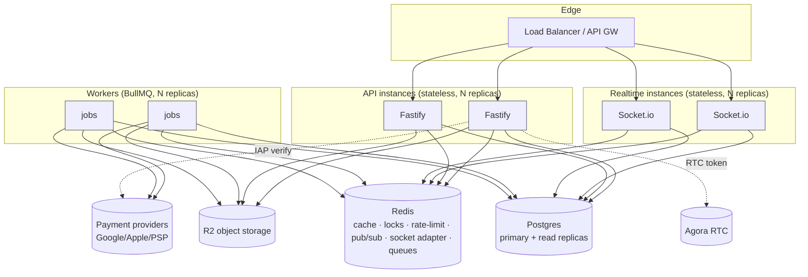

# Voxa Backend — Production Architecture

**Status:** Design (pre-implementation). Per the build plan, this document is approved **before** any
module code is written.
**Audience:** engineers building/operating the product backend.
**One-line framing:** this is no longer a reverse-engineering project. The product backend is a
first-class, horizontally-scalable service with **zero runtime dependency** on the old ZaffaLive
backend — the outbound legacy SDK has been removed entirely (see §7).

---

## 1. Scope & reframing

- **Before:** we reversed the original ZaffaLive API and built a typed read SDK to it.
- **Now:** we build **our own** backend that the mobile app talks to. It owns its data, its economy,
  its realtime, and its identity. It does **not** proxy to ZaffaLive to serve users.
- **The SDK's new role:** an *integration adapter* used only by (a) a one-time/data-migration job and
  (b) an offline parity-verification harness. It is imported **only** from `src/integrations/**` and
  `src/workers/**`, **never** from a controller or a user-facing service. (Enforcement in §7.)

## 2. Current state (what already exists)

This is not greenfield. The existing backend already provides most of the target:

| Capability | Status |
|---|---|
| Runtime | Fastify 4 (ESM, Node 20), Zod validation, Pino logging |
| Data | Prisma + Postgres — **51 models** (User, Wallet, WalletLedger, Room, RoomPk, Gift, GiftTransaction, Product, Order, VipLevel, Agency, CommissionRecord, WithdrawalRequest, Ranking, Notification, Medal, …) |
| Auth | JWT access + **rotating refresh** (Redis jti denylist), real Google ID-token verification, Agora RTC token minting |
| Economy | Append-only `WalletLedger` with shared `Currency` / `LedgerReason` enums; `serializableTx`; `idempotency` |
| Realtime | Socket.io gateway + Redis adapter; `ws-ticket` handshake |
| Async | BullMQ workers + queues |
| Cross-cutting libs | `authz`, `ledger`, `tx`, `idempotency`, `events`, `redis`, `agora`, `r2`, `errors`, `env`, `crypto` |
| Modules (20) | auth, users, wallet, rooms(+pk), chat, dm, bottle, gifts, ranking, agency, vip, couple, moments, medals, moderation, notifications, decorations, uploads, admin, config |

**Consequence:** the work is **formalization + gap-filling**, not a rewrite. The 12 required modules
map onto existing code; only **Tasks** and **Payments** are genuinely missing, and a few modules need a
layer added (see §6, §11).

## 3. Architectural principles

1. **Strict layering per module:** `Controller → Service → Repository → DB`. Controllers do HTTP only;
   Services hold **all** business logic; Repositories hold **all** persistence; DTOs cross the
   boundary (never leak Prisma entities to the wire).
2. **Dependency direction is inward and downward.** Controllers depend on Services; Services depend on
   Repositories and cross-cutting libs; nothing depends upward. No module imports another module's
   Repository — cross-module needs go **Service → Service** (or via events).
3. **Business logic lives in Services only.** Not in controllers, not in repositories, not in the SDK.
4. **The economy is transactional and idempotent.** Every balance change is a `serializableTx` that
   writes `Wallet` + `WalletLedger` atomically and is guarded by an idempotency key.
5. **Stateless request handling.** No in-process session/user state; all shared state in Postgres or
   Redis. Any instance can serve any request; any worker can process any job.
6. **Validation at the edge, invariants in the core.** Zod validates/parses input in the controller;
   Services enforce business invariants and authorization.
7. **The upstream SDK is infrastructure.** Rule #4/#5/#6 from the brief are architectural constraints,
   enforced by an import boundary (§7).

### The canonical module

```
src/modules/<name>/
  <name>.routes.ts        # Controller: HTTP verbs, auth guard, DTO (de)serialization, calls Service
  <name>.service.ts       # Service: business logic, invariants, orchestration, events, transactions
  <name>.repo.ts          # Repository: Prisma queries only (the sole place that touches the DB)
  <name>.dto.ts           # DTOs + mappers (entity → response DTO) — the wire contract
  <name>.schema.ts        # Zod request/param schemas (validation)
  <name>.events.ts        # (optional) event names + payload types this module emits/consumes
  __tests__/…  or  *.test.ts
                          #   unit (service, pure), repo (against a test DB), api (route-level)
```



## 4. System architecture (runtime)



- **Three horizontally-scalable tiers:** API, Realtime, Workers — all stateless, all replicated behind
  the LB / sharing Redis + Postgres.
- **No sticky sessions.** WebSocket fan-out uses the Socket.io **Redis adapter**; a `ws-ticket` (short
  Redis token) authorizes the socket, so any RT instance can accept any connection.
- **Read/write split ready:** repositories can route reads to replicas (see §9).

## 5. Cross-cutting concerns (platform)

| Concern | Mechanism | Notes |
|---|---|---|
| **AuthN** | JWT access (short TTL) + rotating refresh; `jti` denylist in Redis | already implemented; formalize into an `auth.service` |
| **AuthZ** | `lib/authz` guards (role/room-role/ownership) applied in Services | keep authorization in Services, not controllers |
| **Validation** | Zod schemas per module; parse in controller | reject before Service runs |
| **Errors** | `lib/errors.AppError(code,status)` + one Fastify error handler → uniform envelope | controllers never hand-format errors |
| **Transactions** | `lib/tx.serializableTx` | all multi-write economy ops |
| **Money** | `lib/ledger` (`Currency`, `LedgerReason`) + append-only `WalletLedger` | single source of economic truth |
| **Idempotency** | `lib/idempotency` (key → once-only) | required on: recharge, gift send, withdraw, task claim, purchase |
| **Events** | `lib/events.emit` (Redis pub/sub) | decouple modules; realtime + notifications subscribe |
| **Realtime** | Socket.io + Redis adapter + `ws-ticket` | room/seat/chat/gift/pk push |
| **Caching** | Redis, read-through with TTL + explicit invalidation | config, gift catalog, level ladders, rankings (§9) |
| **Rate limiting** | `@fastify/rate-limit` (Redis store) | per-IP global + per-route economic caps |
| **Config** | `lib/env` (Zod-validated) + `Setting`/`config` module for runtime toggles | fail-closed prod invariants |
| **Observability** | Pino structured logs; add request-id, metrics (RED), health/readiness | §12 |
| **Secrets** | env-only; never logged; economy/token secrets fail-closed in prod | reuse existing invariants |

## 6. Module catalog (the 12 required)

Each module follows the canonical layering (§3). "Owns" = the Prisma models it is the sole writer of.
"Status" reflects the current tree; **Δ** marks gap-fill work (detailed in §11).

### 6.1 Authentication  `modules/auth`
- **Owns:** `UserIdentity` (auth side), refresh denylist (Redis).
- **Controller:** `POST /auth/login` (provider), `/auth/refresh`, `/auth/logout`, `/auth/rtc-token`.
- **Service:** provider verification (Google real; Apple/Facebook/phone adapters), token mint/rotate,
  revocation, RTC-token issuance. **Δ extract logic from routes into `auth.service.ts`.**
- **Repository:** identity upsert/link.
- **DTO/Validation:** `LoginDTO`, `TokenPairDTO`; Zod per provider.
- **Depends on:** Users (create/link profile), `agora`, `redis`, `crypto`.
- **Tests:** token rotation, denylist, audience pinning, provider-adapter stubs.

### 6.2 Users  `modules/users`
- **Owns:** `User`, `Profile`, `UserSetting`, `UserRelation`, level resolution (`LevelConfig` read).
- **Controller:** profile get/update, settings, follow/block, search, level/wealth read.
- **Service:** profile lifecycle, relations, level/wealth/charm resolution (config-as-data).
- **Repository:** `users.repo` (exists partially). **Δ formalize repo + DTO mappers.**
- **Tests:** exist (level resolver, settings) — extend for relations.

### 6.3 Wallet  `modules/wallet`
- **Owns:** `Wallet`, `WalletLedger`.
- **Controller:** balance, ledger history, jewel↔coin exchange.
- **Service:** **the only writer of balances** — `credit/debit(userId, currency, amount, reason, refId)`
  in a `serializableTx` + idempotency; exchange. Other modules call **`WalletService`, never the DB.**
- **Repository:** `wallet.repo` (atomic upsert + ledger append).
- **Tests:** concurrency (no double-spend), idempotent replay, ledger invariants. **Δ add repo/DTO.**

### 6.4 Room  `modules/rooms`
- **Owns:** `Room`, `RoomMember`, `Seat`, `RoomTheme`, `RoomMessage` (with Chat).
- **Controller:** create/enter/leave, seat ops (up/down/mute/lock), theme, member/host tools,
  discovery.
- **Service:** room lifecycle, **seat-state machine**, host/role authorization, online count,
  entry effects. Emits `room.*` events for realtime.
- **Repository:** `room.repo` / `room.prisma-repo` (exist).
- **Tests:** rich set exists (seat-state, entry-effect, online-count, discovery). Keep.

### 6.5 Chat  `modules/chat` (+ `dm`, `bottle`)
- **Owns:** `RoomMessage`, `DmConversation`, `DmMessage`, `VoiceBottle`, `BottleReaction`.
- **Controller:** send/list room messages; DM conversations/messages; bottle throw/pick/react.
- **Service:** message validation, moderation hook, fan-out via events → realtime; DM delivery.
- **Repository:** message persistence, conversation cursors.
- **Tests:** exist (chat, dm, bottle). **Δ add repo/DTO; unify moderation hook.**

### 6.6 Gifts  `modules/gifts`
- **Owns:** `Gift`, `GiftCategory`, `GiftPool`, `GiftTransaction`, `UserGiftBag`.
- **Controller:** catalog/tabs, send gift (room/private/song), bag, gift-map, effects.
- **Service:** send-gift orchestration — debit sender (WalletService), credit receiver, lucky-gift
  random payout (`LedgerReason.LuckyWin`), decoration/effect resolution, rank contribution event.
  **Idempotent + transactional.**
- **Repository:** catalog + transaction writes.
- **Tests:** exist (gift, gift-pool, gift-effects). Keep; extend concurrency.

### 6.7 PK  `modules/pk`  *(currently nested in `rooms/pk.service.ts`)*
- **Owns:** `RoomPk`.
- **Controller:** start/join/end PK, PK info, PK record list, rewards.
- **Service:** PK lifecycle/state machine, scoring, settlement (rewards via WalletService), realtime
  push. Depends on Room (context) + Gifts (score contributions) via events/service calls.
- **Repository:** `pk.repo`.
- **Decision (§13):** promote PK to a first-class module (the brief lists it) vs. keep in Room. **Δ**
- **Tests:** move/expand PK tests out of rooms.

### 6.8 Ranking  `modules/ranking`
- **Owns:** `Ranking` (materialized), reads from ledger/gift events.
- **Controller:** room/user/vip/medal/cp/pk rankings; rank prizes.
- **Service:** **read-optimized** — serve pre-aggregated rankings from cache/`Ranking`; a **worker**
  recomputes windows (daily/weekly/monthly) from events. No heavy aggregation in the request path.
- **Repository:** ranking snapshot read/write.
- **Tests:** exist. **Δ add the recompute worker + cache.**

### 6.9 Tasks  `modules/tasks`  **(NEW — missing today)**
- **Owns:** `TaskConfig`, `UserTaskProgress` (**new Prisma models — schema addition**).
- **Controller:** list tasks (new-user/daily), claim reward.
- **Service:** progress tracking (subscribes to `gift.sent`, `recharge`, `room.entered`, … events),
  reward granting via WalletService (idempotent claim), daily reset (worker).
- **Repository:** task config + progress.
- **Tests:** progress accrual, claim-once, daily reset. **Δ full module.**

### 6.10 Notifications  `modules/notifications`
- **Owns:** `Notification`.
- **Controller:** **Δ add routes** — list, mark-read, unread-count (service exists, no controller).
- **Service:** create (from events), delivery (persist + realtime push + optional push provider).
- **Repository:** notification store + cursor.
- **Tests:** **Δ add.**

### 6.11 Agency  `modules/agency`
- **Owns:** `Agency`, `AgencyMember`, `AgencyInvite`, `CommissionRecord`, `WithdrawalRequest`.
- **Controller:** guild info/members, invites, commission/earnings, withdrawal requests.
- **Service:** membership lifecycle, commission computation (exists: `commissionAmount`), withdrawal
  workflow (request → review → payout via Payments/worker). Money via WalletService + ledger.
- **Repository:** agency + commission + withdrawal.
- **Tests:** exist (commission math, api). **Δ add repo/DTO; withdrawal state machine.**

### 6.12 Payments  `modules/payments`  **(NEW — missing today)**
- **Owns:** `Product`, `Order` (exist in schema, no module), provider receipts.
- **Controller:** product list, create order, **provider webhook / receipt verify** (Google Play,
  Apple IAP, third-party PSP).
- **Service:** order lifecycle (`created → paid → fulfilled → failed/refunded`), **server-side receipt
  verification**, fulfillment = credit coins via WalletService (`LedgerReason.Recharge`, idempotent on
  provider txn id), refund/chargeback handling. First-charge bonuses.
- **Repository:** order + receipt store.
- **Depends on:** Wallet (fulfillment), provider adapters in `integrations/payments/*`.
- **Tests:** verify-and-fulfill idempotency, replayed webhook, refund. **Δ full module.**

## 7. Legacy independence — no outbound legacy client (Phase X / Track A)

- The old ZaffaLive backend is **permanently removed**. The outbound migration SDK that used to live at
  `src/upstream/**` has been **deleted** (it was dead code: never imported by any request path, worker,
  or seed). The backend has **zero runtime dependency** on the old server.
- **Enforcement:** `src/architecture.boundaries.test.ts` Rule 1 fails CI if (a) an `src/upstream/**`
  directory reappears, (b) any file imports an `upstream/` path, or (c) any source file references a
  legacy API host/domain/gateway (`zaffalive.com`, `api.zaffa*`, `act.zaffa*`, `/index.php`).
- **Historical parity captures** (the legacy action catalog, response snapshots) live outside `src/`
  as data/tooling only — see `LEGACY_DEPENDENCY_REPORT.md` and `LEGACY_REMOVAL_REPORT.md`. If a one-off
  legacy read is ever needed again, it belongs in a **separate tool package excluded from the build**,
  never back inside `src/`.

## 8. Data-model ownership

Single-writer rule: each model has exactly one owning module's Repository that writes it; others read
via that module's **Service**.

| Module | Owns (writes) |
|---|---|
| auth | `UserIdentity` |
| users | `User`, `Profile`, `UserSetting`, `UserRelation` |
| wallet | `Wallet`, `WalletLedger` |
| rooms | `Room`, `RoomMember`, `Seat`, `RoomTheme` |
| chat | `RoomMessage`, `DmConversation`, `DmMessage`, `VoiceBottle`, `BottleReaction` |
| gifts | `Gift`, `GiftCategory`, `GiftPool`, `GiftTransaction`, `UserGiftBag` |
| pk | `RoomPk` |
| ranking | `Ranking` |
| tasks | `TaskConfig`*, `UserTaskProgress`* (*new) |
| notifications | `Notification` |
| agency | `Agency`, `AgencyMember`, `AgencyInvite`, `CommissionRecord`, `WithdrawalRequest` |
| payments | `Product`, `Order` |
| (platform) vip/medals/decorations/moments/admin | `VipLevel`,`VipHistory`,`Medal`,`UserMedal`,`DecorationItem`,`UserDecoration`,`Moment*`,`AdminUser`,`AuditLog`,`Report`,`Ban`,`Banner`,`Announcement`,`LevelConfig`,`Setting` |

Cross-module writes that must be one transaction (e.g. gift = wallet debit + gift txn) are orchestrated
by the initiating Service calling `WalletService` **inside the same `serializableTx`** (pass the tx
handle), preserving atomicity without a module reaching into another's tables.

## 9. Horizontal scalability

- **Stateless tiers** (API/RT/Workers) scale by replica count behind the LB.
- **Sessions:** JWT only — no server session store; refresh denylist is in Redis (shared).
- **WebSockets:** Socket.io **Redis adapter** for cross-instance fan-out; `ws-ticket` authorizes the
  socket so connections are instance-agnostic (no sticky LB needed).
- **Database:** Postgres primary for writes; **read replicas** for heavy reads (rankings, catalogs,
  histories) — repositories expose `read()`/`write()` clients. Hot economic rows use row-level locking
  inside `serializableTx`; retries on serialization failure (already in `tx`).
- **Idempotency + exactly-once economy:** keyed on natural ids (provider txn id, message id, claim id)
  so retries/replays never double-credit — safe under at-least-once delivery and multi-instance races.
- **Caching (Redis, read-through + explicit invalidation):**
  - Static/config: gift catalog, level ladders, VIP tiers, task config, `Setting` — long TTL, busted on
    admin change.
  - Derived: rankings (recomputed by worker, served from snapshot), room online counts.
  - User-scoped short TTL: profile cards, wallet summary (invalidate on write).
- **Async offload:** rankings recompute, notification fan-out, task daily-reset, withdrawal payout,
  receipt re-verification, and the legacy migration all run as **BullMQ jobs**, keeping the request path
  thin. Queues are Redis-backed and workers scale independently.
- **Backpressure:** rate limits at the edge + per-user economic caps; queue concurrency caps per job
  type.
- **Hot partitions:** big rooms are the natural shard key for realtime; room events are namespaced so a
  popular room's traffic stays isolated on the adapter.

## 10. Directory structure & conventions

```
src/
  server.ts                 # Fastify bootstrap, plugin + route registration, error handler
  lib/                      # cross-cutting platform (authz, ledger, tx, idempotency, events, redis,
                            #   agora, r2, errors, env, crypto, prisma, ws-ticket)
  modules/<name>/           # canonical module (controller/service/repo/dto/schema/events/tests)
  realtime/                 # Socket.io gateway + handlers (consume events, push to rooms)
  queue/  workers/          # BullMQ queues + job processors
  integrations/             # OUTBOUND adapters (payment providers) — NO legacy client (see §7)
  testing/                  # shared test harness (DB reset, fixtures, auth helpers)
prisma/                     # schema + migrations + seed
```

**Conventions:** ESM with `.js` import specifiers; Zod at the edge; DTOs are plain types (no Prisma
types on the wire); Services are pure-ish (I/O via injected repos where practical) for unit testing;
one Fastify error handler owns the response envelope; every economic path has an idempotency key.

## 11. Gap analysis & phased build plan

**Legend:** ✅ exists · ⬤ formalize (add repo/DTO/validation split) · ➕ new.

| Phase | Work | Modules |
|---|---|---|
| **0 — Platform hardening** | Formalize error handler, DTO convention, `read()/write()` DB clients, import-boundary lint (§7), test harness | lib, server |
| **1 — Economy core** | ⬤ Wallet repo/DTO + concurrency tests; make WalletService the sole balance writer used by all economy modules | wallet, gifts, agency |
| **2 — Identity** | ⬤ extract `auth.service`; ⬤ users repo/DTO | auth, users |
| **3 — Rooms & realtime** | ⬤ room repo/DTO tidy; confirm event→realtime contracts | rooms, chat |
| **4 — PK** | ⬤/➕ promote PK to its own module (decision §13) | pk |
| **5 — Payments** | ➕ full module + provider adapters + webhooks + fulfillment | payments |
| **6 — Tasks** | ➕ new Prisma models + full module + event subscriptions + daily-reset worker | tasks |
| **7 — Notifications** | ➕ controller/routes over existing service; realtime push | notifications |
| **8 — Ranking at scale** | ➕ recompute worker + snapshot cache | ranking |
| **9 — Migration/verify** | ➕ `integrations/` job using the SDK to backfill + parity-check | integrations |

Only **Payments** and **Tasks** are net-new modules (+ their Prisma models). Everything else is
layer-formalization on working code.

## 12. Non-functional requirements

- **Availability:** stateless tiers + managed Postgres/Redis; graceful shutdown drains connections.
- **Latency SLO (p95):** read endpoints < 150 ms (cache-hit), economic writes < 300 ms.
- **Consistency:** economy is strongly consistent (serializable tx); rankings/feeds are eventually
  consistent (worker-recomputed).
- **Observability:** structured logs w/ request-id + user-id (never token); RED metrics per route;
  economic counters (credits/debits/failures) per `LedgerReason`; `/healthz` (liveness) + `/readyz`
  (DB/Redis check); signature/verify-failure alarms on Payments.
- **Security:** JWT rotation + denylist; authorization in Services; server-side receipt verification;
  idempotent economy; secrets fail-closed in prod; least-privilege DB roles; PII minimization in logs.
- **Testing bar:** every module ships unit (service), repo (test DB), and api (route) tests; economy
  paths ship concurrency + idempotency tests; CI runs `tsc` + `vitest` + lint + the import-boundary rule.

## 13. Decisions needed from you

1. **PK placement:** promote to its own top-level module (matches the brief) or keep nested in Rooms?
   *(Recommend: promote — it has its own lifecycle + endpoints.)*
2. **Payments providers:** which to implement first — Google Play, Apple IAP, and/or a regional PSP?
   This drives the adapter set and webhook design.
3. **Legacy migration:** is a one-time data backfill from ZaffaLive in scope now (users/economy), or
   do we launch clean and only keep the SDK for parity verification?
4. **DTO/repo formalization depth:** apply the full Controller/Service/Repository/DTO split to **all**
   20 existing modules, or only the 12 required ones for now (others follow later)?
5. **Multi-currency/region for Payments** (pricing tiers, FX) — needed at launch or later?

## 14. Risks

- **Economy correctness** is the highest-stakes area — mitigated by single-writer WalletService,
  serializable tx, and idempotency, but demands the strongest tests before launch.
- **Payments fraud/replay** — mitigated by server-side verification + idempotency on provider txn id;
  needs provider-specific hardening.
- **Ranking hot path** — must never aggregate in-request; enforce the worker+snapshot pattern.
- **Scope creep from the other 8 platform modules** (vip/medals/moments/etc.) — keep them out of the
  critical path; formalize opportunistically.

---

**Gate:** implementation begins only after this document is approved and the §13 decisions are made.
No module code is written before then.
